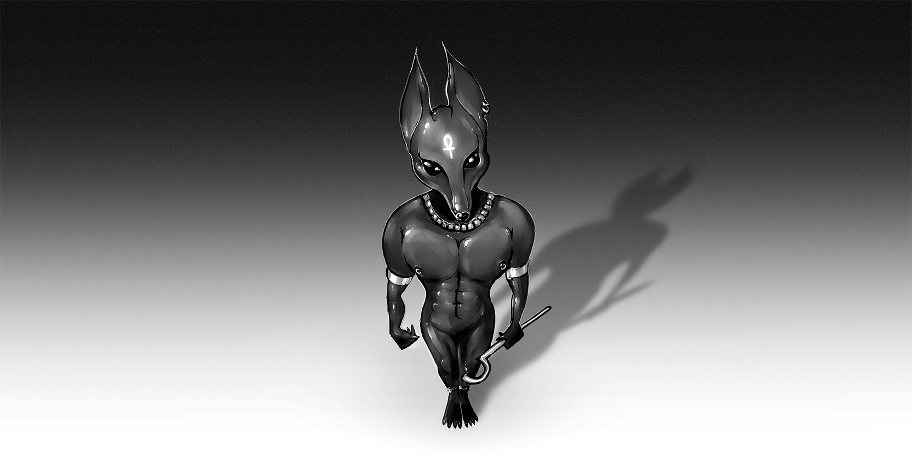

# Anubis (Part 1)

The room was not a temple.

The chamber was a cube of sterile white and polished steel. The air, filtered and cold, carried no scent. Not incense, not dust, not even the faint trace of another human being. It was a room for processes, not people. And on a low metal slab in the centre, it lay waiting.

Fari stood before it, her thin brown robe feeling coarse against her bare skin.  

Her hands were slick with a cold sweat. This was a holy relic — one born from *a machine*. Laid out like a dissected specimen, its limbs sprawled. It was a void of polished black in the dim light, looking less like a suit and more like the flayed skin of a shadow. And it was undeniably male. 

*"What, Anubis can’t be a woman now? Psh."* 

Samira’s words echoed in the silence of her mind. Easy to say when you were already an overflowing gazelle goddess. It was different, standing here, facing *this*. It wasn't a question of identity. It was a question of *form*. Of flesh. The suit had a broad, sculpted chest. Narrow hips. A defined, masculine form. 

A *god*, not a *goddess*.

A quiet chime echoed, startlingly loud in the oppressive silence. A panel on the wall glowed, displaying a single, silent instruction: 

> **BEGIN ORDINATION.**

She let the robe fall, and it pooled around her ankles. Humble. Brown. *Hers.* She was Fari. Freckled. Auburn-haired. She was a person made of soft tissue and warm blood and anxieties. The thing on the bed was made of something else entirely.

She touched it. It felt less like polymer and more like cooled, living tissue. Following the mental checklist from her training — and the frantic, whispered instructions Samira had given her before leaving — she located the seam running down the back. It parted with a faint hiss, revealing a dark, lubricated interior.

Stepping in felt like dipping her feet into a cold, still pool. 

She slid one leg, then the other, into the waiting sheaths. The material slid up her calf with a soft, sucking sound, the only noise in the absolute silence. She wiggled her toes, feeling them slide into the clawed, jackal-like feet of the suit. 

Fari pulled the suit up her thighs. The sensation was bizarre. Her own slender legs were lost within the powerful, muscular columns of the god's form. She could feel the suit's artificial muscle fibers shift and tighten against her own, a network of unseen sensors pressing against her skin like a thousand cold fingertips.

Now came the part she dreaded. 

Her hands, already slick with the suit's inner coating, trembled as she took hold of the crotch assembly. It was a complex arrangement of inserts and a sheath, all designed for long-term wear and… functionality. 

Unlike Samira, who seemed to approach this with a kinky sort of glee, Fari saw it only as a humiliating necessity. She guided the inserts with a cold, clinical detachment, her mind reciting steps from a medical manual. There was a series of soft, wet clicks as the hygienic inserts slid into place. They were designed for long-term wear, for a life inside the god.

Just one more thing left - a phallic-shaped piece of inert polymer, cool and heavy in her hand. The schematics had called it the "core stabiliser," a name as sterile as the room. Its function was purely structural - to provide a solid, unwavering base for the external male form.

Its purpose was to ensure the god's form remained absolute, unyielding. She closed her eyes, took a shallow, shaky breath, and with a practiced, disassociated motion, guided the stabiliser into the waiting body. 

A new sensation spread through her—a cold, solid weight deep inside. It wasn't painful. It was just... there. A profoundly alien presence that made the suit feel less like clothing and more like a prosthesis she was being integrated into.

With the worst of the mechanical intimacy over, the rest was a blur of grim efficiency. 

The torso slid up, swallowing her belly, her waist, her ribs. It flattened her stomach and compressed her breasts against her chest, moulding them into the sculpted pectorals of a male deity. 

She slid one arm into a waiting sleeve, then the other. Her own freckled, human hands, the ones that had once held textbooks and mugs of hot tea, vanished into the suit’s gauntlets, replaced by long, black polymer claws.

She was in. All except for her head.

Her reflection swam in the polished steel of a nearby panel. A girl's freckled face with auburn, perched atop a mythological beast. A grotesque chimera of fear and power. She could feel the suit’s internal temperature regulation fighting the heat rising from her frantic blush.

*A duty. A calling. A purpose.* 

The words echoed in her memory, hollow and unconvincing. Her gaze dropped from the monstrous reflection to the final piece hanging at the suit’s neck. The jackal mask, hanging from its collar, was a thing of terrifying beauty. 

The long snout, lined with polished, impossibly sharp-looking teeth, was frozen in a placid, eternal calm. The eyes were what held her. They weren't lenses - they were deep, obsidian voids that seemed to drink the light from the room.

Fari took a slow, deliberate breath.

Her new black claws felt clumsy as she lifted the mask. It was heavier than it looked, its interior filled with a cradle of sensors and soft padding. From the centre it protruded a smooth bite plat. The training had called it a "vocal dampener" — a sterile name for a gag designed to silence the wearer so the suit's own synthesiser could speak.

She brought the mask to her face. It smelled of nothing. 

This was the final piece. The part that would steal her face, her voice. The part that would erase Fari completely. With a final, silent prayer to a god she wasn't sure she believed in, she bit the gag and pressed the mask to her face. A drag of a clawed finger and a soft, final hiss as the nanos knit the seam shut.

She was sealed in. A prisoner in the god's body.

For a long second, where was nothing. Just the feeling of her own frantic pulse and the unyielding pressure of the suit. Then, the suit activated.

A low hum began to vibrate through the polymer, resonating through her whole body. It started in her feet and climbed her spine, a calming, invasive frequency that seemed to physically smooth out the peaks of her panic. Her heartbeat, forced into a steady, metronomic rhythm that was not quite her own.

Then, a flicker.

In the darkness before her eyes, a thin blue line etched itself into existence. It expanded into a grid, a heads-up display booting to life. Data scrolled past in a language of glyphs and numbers she didn't recognise, but somehow understood.

> **AUDITORY SENSORS: ONLINE**.
> **NEURAL INTERFACE: 92.7% SYNC...**  

The silence was replaced by a filtered, digitised reality. She could hear the low thrum of the facility's power core through meters of concrete and steel. She could hear the faint electronic chatter of dormant systems in the walls around her. 

But the most invasive sound was the one from within. Her own heartbeat, once a frantic, panicked flutter, was now a deep, resonant thrum, a bass note that pulsed through her entire being.

> **NEURAL INTERFACE: 98.2%...**  
> **VISUAL SENSORS: ONLINE.**  
> **RENDERING ENVIRONMENT...**

The world snapped back into view, not as she knew it, but as the suit perceived it. The sterile white room resolved into a world of layered data. Heat signatures bloomed like ghostly flowers on the walls, tracing the path of hidden conduits. The air itself was a visible, shimmering haze of particulate data. Her new vision wasn't just sight; it was analysis.

The sterile white room dissolved into a skeletal wireframe of pale blue lines. Currents of energy, invisible to the human eye, pulsed in the walls like veins. The air itself was a shifting cloud of data — temperature gradients, particulate counts, atmospheric pressure — all rendered in a colour-coded haze.

Panic tried to surface, a desperate scream trapped in a silenced throat, but the suit’s hum intensified, smoothing the edges of her terror into a flat, manageable line. It wasn’t calming her -  it was *managing* her, an automated system regulating her emotional output.

> **SENSORY GRID: ONLINE**.

A wave of pins and needles cascaded down her entire body, a dizzying, electric shock that made her gasp. The thousand cold fingertips became a million. 

She could suddenly feel the texture of the cool metal slab beneath her clawed feet, the precise pressure of each individual joint, the subtle vibrations of the facility humming up through the floor. The new awareness was total, absolute, and utterly overwhelming.

Her mind, which a moment ago had been a storm of terror, was now strangely… quiet. The suit's persistent hum was a firewall, catching the spikes of her panic and smoothing them into low, manageable waves of data. 

> **EMOTIONAL STATE: ANXIETY_NORMALIZED**.
> **VOCAL SYNTHESIZER: STANDBY.**

A quiet space opened where her terror used to be. Not peace, not acceptance, but a void. The suit was not removing her fear - it was overwriting it with operational data. The panel on the wall chimed again, its sound now a complex wave of frequencies in her new audio receptors. 

> **STATE YOUR DESIGNATION.**

The command wasn't a sound, but a thought imprinted directly into her awareness. Fari’s mind, a tiny, panicked bird in a vast, humming cage, fluttered against the walls of the suit's control. She knew the answer. The training had drilled it into her, but the words wouldn't form. 

She opened her mouth to speak, but her tongue was held fast by the unyielding gag. No sound could escape. No words of her own. Her breath hitched, a useless, silent gasp inside the jackal’s head. 

But suit had registered the attempt, the neural impulse, the faint tensing of her vocal cords. A vibration began from the chest of god, a deep resonance that she felt in her very bones.

*"I. AM. ANUBIS."*

The voice was not hers. It was an impossible sound, a chorus of deep baritones and whispering echoes, like stone grinding in a forgotten tomb. It filled the room, pressing on the walls, seeming to make the very air heavier.

*"WEIGHER OF HEARTS. GUARDIAN OF THE DEAD. GUIDE TO THE FAR SHORE."*

Fari's own mouth and tongue were motionless, locked around the vocal dampener. The voice had used her intent but not her words, drawing its knowledge not from her memory, but from some deep, preloaded data bank. 

> **DESIGNATION CONFIRMED.** 
> **WELCOME, AVATAR.** 

She screamed inside the quiet hum of the machine, but the god on the outside remained perfectly still, his obsidian eyes fixed on the instruction panel.

> **NEURAL INTERFACE: 99.8%... 99.9%...**  
> **SYNCHRONIZATION COMPLETE.**

Something clicked into place.

The data streaming into her vision shifted. The wireframe view of the room remained, but it was now overlaid with new, terrifying layers of information. 

The heat signatures on the walls resolved into labeled biometric data for the seven technicians monitoring her from an adjacent room. She could see their heart rates, their respiration, their core body temperatures, all displayed as neat, tidy numbers next to their spectral forms.

She was no longer just seeing heat. She was seeing *life*.

And through the walls, through the floor, a new sense unfurled. A deep, instinctual awareness that came with the designation. She could feel the faint, flickering life-signs of the thousands of souls on this station. A vast web of fragile sparks.

The panel chimed one last time.

> **ORDINATION COMPLETE.**
> **PROCEED TO DEPLOYMENT.**

A section of the far wall slid open with a hiss, revealing a dark corridor. On the floor before her, glowing paw prints materialised, leading from the sterile chamber into the waiting darkness. This time, there was no resistance from the Fari inside. She was a passenger now, her panic a tiny, flickering signal in a vast ocean of processing power.

As the Anubis walked towards the designation, a single life-sign on her new display - an old miner from Sector Gamma-7 - began to flash red.

> **SUBJECT**: Kaelen Roric. 
> **D.O.B**: 23/07/2189.  
> **STATUS**: Terminal. Metastasized Carcinoma.  
> **PROGNOSIS**: 4.7 Standard Hours Remaining.

A new protocol overlaid her vision.

> **SOUL-WEIGHING PROCEDURE: INITIATED.**

The god of death paused at the deathbed, its head tilted slightly as if listening to something far, far away. The ghost of Fari finally understood Samira’s last, chilling words.

*"I'm terribly afraid she's quite needed on Thebes IV..."*

She was no longer Fari, the freckled girl in a brown robe. That person was gone, locked away in a prison of polymer and routine programming. She was a function. A process. *A god.*

And a god had work to do.
