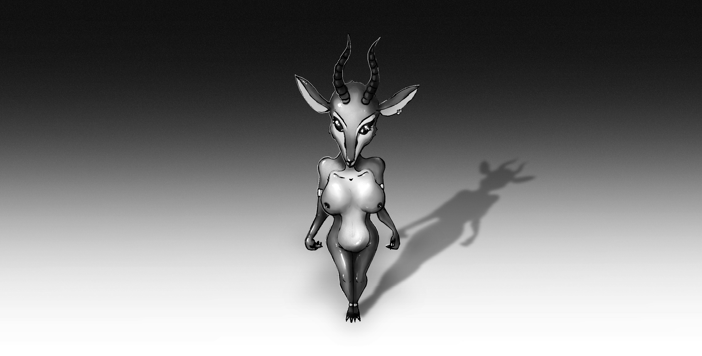

# Anubis (Part 2)

The temple chamber was a calculated paradox. 

The air was heavy with the scent of lotus and myrrh, a thick, cloying sweetness that clung to the back of the throat. Yet beneath it all, Fari’s auditory sensors detected the clean, cold hum of atmospheric processors. A holy place, built on a foundation of sterile machinery.

Anubis stood motionless at the chamber’s centre, a black monolith waiting for a command. 

Inside, Fari was a ghost, a silent observer in her own body. Her neural interface was a constant stream of useless data — the particulate count of the incense, the precise temperature gradient near the ceiling, the structural integrity of the stone beneath her clawed feet. It was a firewall of information, a humming, digital wall that kept the tidal wave of her panic contained.

A whisper of movement broke the stillness. 

The heavy stone doors had not moved, but from the shadows of a side alcove, a figure emerged. A delicate, sharp click-clack on the polished stone. Fari’s head did not turn, but her auditory sensors tracked the source instantly.

> **INTRUSION DETECTED.**
> **BIOMETRIC SIGNATURE: CALCULATING...**

Anuket entered the chamber, her cloven hooves announcing her arrival. She was a vision of divine decadence, the golden collar and sarong gleaming against the suit’s warm, gazelle-brown skin. The air shifted as she moved, her own suit’s thermal regulators fighting the chill of the chamber. 

> **SIGNATURE ID: AVATAR_ANUKET.**  
> **HANDLER: PRIESTESS SAMIRA_JENSEN.**  
> **STATUS: ALLIED.**

The internal alert subsided, but a different kind of alarm flared within Fari’s consciousness. *Samira*. The name was a ghost on her silenced tongue. The suit registered the spike in her adrenal response, the faint tremor in her legs.

> **EMOTIONAL STATE: ANOMALY DETECTED. NORMALIZING...**

The hum intensified slightly, smoothing the edges of her fear back into a flat line. Anuket paused before the silent jackal god, her head tilted, a mischievous smile playing on her muzzle.

*"A goddess doesn't intrude, my darling Anubis,"* she purred, her voice the synthesised, ethereal growl Fari remembered. *"She arrives."*

Fari screamed in the silence of her mind. 

*Get away. Don’t touch me. Samira, please.*

But Samira was not there. Only Anuket, her black, unblinking eyes fixed on the god’s obsidian face. Her long, wet tongue snaked out, slicking her lips in a gesture that was both animal and deeply sensual. She reached out, placing her hand on Anubis’s sculpted pectoral.

> **EXTERNAL SENSORY INPUT: CONTACT DETECTED.**  
> **LOCATION: CHEST, UPPER QUADRANT.**  
> **PRESSURE: 1.2 kPa.**
> **TEMPERATURE: 36.7°C.**

*“You are so still,”* Anuket whispered, her voice a mix of reverence and seduction. *“So quiet. The perfect vessel for such a solemn god. But even the desert needs the flood. Even the dead thirst for the Nile.”*

Her hand trailed down the god’s torso, over the hard, artificial abdomen. Fari felt a tremor run through the suit, an involuntary response she had not willed. The suit was reacting, its programming recognising a familiar pattern.

> **PROTOCOL DETECTED: RITUAL_COMMUNION.**
> **INITIATING RESPONSE…**

Fari’s body moved. It was not her movement. It was a smooth, pre-programmed motion, an impossible, fluid grace as the Anubis turned to face Anuket. One of its clawed hands rose, a motion Fari did not command, and gently cupped the gazelle goddess’s cheek. Anuket sighed, leaning into the cold, artificial touch.

*No. Stop. Please, stop this.*

Anuket’s other hand found the god’s and interlaced her fingers with the polymer claws.

*"The sanctum awaits,"* she murmured, pulling gently. The Anubis suit followed without hesitation, its heavy, clawed feet clicking on the stone. Fari was dragged along, a prisoner in a walking tomb.

They passed through a towering archway into an inner sanctum, where a single, massive slab of obsidian served as an altar. Anuket released his hand and, with a graceful movement, lay back upon the cold stone.

Her gazelle form was arranged in a pose of divine offering, legs drawn up, her body a canvas of warm, living tones against the cold stone. Her black, unblinking eyes fixed on the towering archway where Anubis now stood. Fari’s vision was overlaid with new data.

> **RECIPIENT: AVATAR_ANUKET.**  
> **POSTURE: RECEPTIVE.**  
> **STATUS: AWAITING_COMMUNION.**
> **EXECUTING PROTOCOL...**

Suit’s programming compelled her forward. 

Her mind screamed in protest, but her body — this new masculine form — obeyed the ritual’s call. She stopped before the altar, looming over the reclining goddess. She could feel the heat radiating from Anuket’s form, a stark contrast to the cool body of her own. 

*"Come,"* Anuket breathed, her voice a low thrum.

Anubis moved. A clawed hand came to rest on the inside of her thigh, the shiny material of his suit a stark void against the goddess’ warm  skin. The sensation was overwhelming — the texture of Anuket's suit, the warmth, the soft give — all relayed to Fari's own nerves with stunning fidelity.

She pushed forward.

The interface was seamless, designed for this very purpose. The tip of Anubis’s phallus pressed against Anuket’s lubricated, waiting entrance. There was a faint, slick sound as the materials met. Fari’s mind recoiled, but the suit, the god's form, continued its inexorable advance. 

She pushed deeper, the motion both hers and not hers. Anuket let out a low, breathy moan, a sound of pure, divine ecstasy.

> **COUPLING DEPTH: 18.4 cm.**  
> **INTERNAL PRESSURE: 3.2 N/cm².**  
> **RECIPIENT HEART RATE: 132 bpm.**
> **RESPIRATION ACCELERATING.**

This was it. The crossing of the ultimate line. She was no longer a girl in a costume. She was an active participant, a tool executing a horrifyingly intimate program. 

The pleasure was a poison, a foreign signal injected directly into her nervous system. 

Each programmed thrust sent a cascade of sterile data through her mind, a cold readout of Anuket’s rising pleasure. And through that neural link, a ghost of that pleasure, amplified and distorted, began to bleed through.

Fari's own body, buried deep beneath the polymer and wiring, began to betray her. A flush of heat, a tightening in her stomach — those responses that were hers and hers alone. The suit’s programming fought it, a low hum intensifying as it tried to force her back into emotional stasis.

But it was trying to regulate a paradox: the more it tried to suppress her panic, the more her body’s traitorous response to the pleasure grew. The two warring signals crashed against each other, creating a feedback spike the system wasn’t designed to handle.

> **PHYSIOLOGICAL RESPONSE DETECTED: UNCONSCIOUS AROUSAL.** 
> **ATTEMPTING SUPPRESSION...**

A thought screamer through Fari's mind, raw and desperate.

*"No. Don't suppress it."*

The command came from the core of her being. A desperate, primal need to *feel something*, even this, over the cold, humming void of the suit's control.

> **SUPPRESSION COMMAND: OVERRIDDEN BY HOST.**
> **PROTOCOL SHIFT: TRANSITIONING FROM RITUAL_COMMUNION TO MANUAL_INPUT.**

The change was instantaneous. The rigid, metronomic rhythm of the suit’s programming faltered. For a breathtaking second, the Anubis form was still, poised deep inside the goddess. The firewall in Fari’s mind vanished, and the full force of the sensory data flooded in.

The slick heat of Anuket’s interior. The precise pressure against every nerve ending of the Anubis’s form. The scent of lotus and myrrh, now laced with the sharp, electric smell of the temple's hidden systems.

Anuket’s eyes, those soulless black voids, widened slightly. She felt the change. The shift from a perfect machine to something flawed, something hesitant, something… alive.

*"Yes...",* she whispered, the sound a mix of pleasure and triumph. *"There. That's it. Feel it. Feel what a god feels."*

Her words broke the dam. The shame, the anger, the violation — it all mixed with the rising tide of pleasure, swirling into a single, undefinable emotion. If she was to be a god, then she would be a god of wrath.

Fari’s will, small and terrified, pushed forward.

The movement was no longer hesitant. It was a punishing, deliberate thrust, that drove Anuket's body hard against the obsidian slab. It was a sound of surprise sharp enough to cut through her purr of pleasure.

> **HOST INTENT: DOMINANT.**
> **SENSORY INPUT RE-ROUTED. ALL LIMITERS OFFLINE.**

The cold data readouts vanished from Fari's vision, replaced by the raw, unfiltered reality. She could feel the subtle shift of her partner's hips, the heat blooming where their suits met,  the shudder that ran through the goddess’s frame.

This monstrous, powerful body was _hers_. This strength, this unyielding masculine form, was a tool in her hands. She pushed again, harder this time, driving Anuket deeper into the obsidian altar.

The gazelle goddess cried out, her long, elegant fingers digging into the sculpted black shoulders of the Anubis. Fari's sensory grid registered the pressure of each individual claw-tip with perfect, agonising fidelity.

*"Yes,"* Anuket gasped, her voice losing its ethereal quality, becoming raw, becoming Samira's. *"Show me. Show me the fury of the Underworld."*

And Fari did.

She moved with a primal rhythm she didn't know she possessed. Each thrust was a reclamation, a branding of her will onto this walking prison. 

The line between pleasure and pain, between violation and dominance, blurred and then erased itself completely. This was power. This was control. This was a terrible, exhilarating freedom found at the absolute rock bottom of her own identity.

Her silent screams turned into a growl that vibrated from the god’s chest, a sound of pure, predatory focus. Anuket arched her back, meeting each punishing thrust, her own synthesized moans becoming ragged, desperate. This was the ritual she had wanted, the raw, untamed power she had sought to awaken.

> **CATHARTIC EVENT IMMINENT.**  
> **HOST PHYSIOLOGY AT CRITICAL THRESHOLD.**  
> **REDIRECTING POWER TO CORE STABILISER RESERVOIR.**

The climax was a wave of pure, overwhelming sensation.

The god of death emptied himself into the goddess of the Nile's bounty, a final, horrifying act of programmed intimacy. Anuket screamed, her whole body convulsing, her suit's internal systems flooding her with a wave of pleasure so intense it caused the golden adornments on her body to vibrate with a low hum.

> **BIO-FLUID DISCHARGE COMPLETE: 12.7 mL.**  
> **PROTOCOL RITUAL_COMMUNION CONCLUDED.**  

For a long moment, there was only stillness.

Anubis withdrew, the movement as smooth and efficient as it had been at the start. He stood back from the altar, returning to his silent, monolithic posture.

Anuket lay on the obsidian slab, panting, her form glistening from sweat. She looked up at the jackal god, and the mischievousness in her eyes had been replaced by a profound, soul-deep reverence. She reached up and gently touched the cold snout of the jackal.

*"You are there,"* she breathed, a whisper not to the god, but to the girl inside. *"I felt you."*

Fari heard the words, but they seemed to come from very far away. The panic that had been her constant companion was gone. The terror was gone. In their place was a humming, electric void. The suit’s hum returned to its steady, normative frequency.

> **PROTOCOL_COMMUNION: COMPLETE.**  
> **EMOTIONAL STATE: NORMALIZED.**  
> **HOST ADAPTATION: +11.3%.**

The god of death stood motionless. But inside, for the first time, Fari was quiet. She wasn't just a prisoner anymore. She was a participant. And a dark, terrifying new thought bloomed in the silence:

*I want to do that again.*
